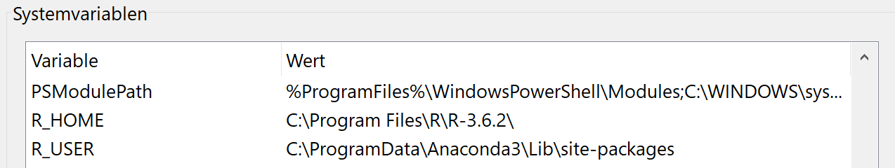

## Aufsetzen von Jupter-Lab

Um Jupter-Lab einfach zu benutzen wird die Anaconda Disitribution für Python/R empfohlen.

Diese kann unter folgenden [Link](https://www.anaconda.com/distribution/) heruntergeladen werden.

Wenn Anaconda erfolgreich installiert wurde, kann man mit folgenden Befehlen die Programmiersprache R und alle benötigten Dependencies für Jupyter installieren. ,  

```
conda install -c r r-irkernel
pip install seaborn 
pip install matplotlib
pip install ipywidgets
pip install nbinteract
pip install pandas
pip install tzlocal
jupyter labextension install @jupyter-widgets/jupyterlab-manager  
jupyter labextension install @jupyterlab/celltags
jupyter nbextension enable --py widgetsnbextension --sys-prefix 
jupyter lab build
```

Jupyter sollte jetzt mit folgenden Befehl startklar sein:

```
jupyter-lab
```

## Python und R gemeinsam ausführen

Um R Befehle in gemeinsam mit Python Befehlen in einen Jupyter-(Python)-Notebook zu benutzen, kann man das Package `rpy2`verwendet werden. 

Linux und Unix Benutzer können das Paket mithilfe von pip installieren, unter Windows funktioniert dies nicht, dafür gibt es aber schon fertige Windows Binaries, die [hier](https://www.lfd.uci.edu/~gohlke/pythonlibs/#rpy2) zu finden sind.  

```
# Linux/Unix
pip install rpy2
# Windows
pip install .\rpy2-2.9.5-cp37-cp37m-win_amd64.whl
```

Damit `rpy2`ordnungsmäßig funktioniert, müssen `R\_HOME` und `R\_USER`in den Systemumgebungsvariablen gesetzt werden. Windows Benutzer können folgende [Hilfestellung](https://en.it1352.com/article/a7469d375f9b40f9b2f4f52567f243ab.html) verwenden.



## Jupyter-Lab Tastenkürzel

* `B` - Neuer Codeblock
* `ESC-M-Enter` - Block zu Markdown umwandeln
* `ESC-A-Enter` - Block zu Code umwandeln
* `ESC-R-Enter` - Block zu Raw umwandeln.




